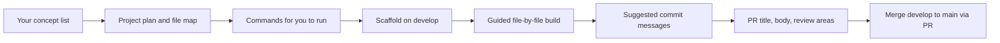

# React Learning Repository — Working Agreement

## Current State

Your repo already matches much of your described setup:

| Item | Status |
|------|--------|
| Branch strategy | `develop` (current) and `main` exist locally and on `origin` |
| Existing projects | [`01basicreact/`](01basicreact/) — Create React App; [`02vitereact/`](02vitereact/) — Vite + React |
| Recent history | `initial React workspace` on `develop` |

When you share your concept list, each new demo will be added as a **sibling folder** at the repo root (e.g. `03props-demo/`, `04state-demo/`), following the same pattern as your existing projects.

---

## What Happens When You Send Your Concept List

You said you will share a list of React concepts after finishing a tutorial. Once you do, I will:

1. **Map concepts to projects** — Group related concepts into small, focused apps (similar to your examples: `props-demo`, `state-demo`, `hooks-demo`, etc.).
2. **Propose one project at a time** — Each project gets a clear learning goal before any files or commands are suggested.
3. **Explain before you act** — No silent automation. Every step is broken into teachable pieces.

---

## Per-Project Workflow (Teaching-First)

For each demo project, the flow will look like this:



### Phase 1 — Plan the project

Before any commands, I will explain:

- **What** the project demonstrates (one primary concept, optional related concepts)
- **Folder name** and why (numbered prefix like `03props-demo` keeps order clear in a multi-project repo)
- **File tree** — every file that will exist and its React responsibility
- **How components connect** — props flow, state ownership, entry point (`main.jsx` → `App.jsx` → children)

### Phase 2 — Commands (you run, I explain)

I will list commands in order, each with:

- **Command** — exact text to copy
- **Purpose** — what it does in 1–2 sentences
- **Why** — why it is needed for this learning step

Typical sequence for a new Vite project (matching your existing [`02vitereact/`](02vitereact/) stack):

```bash
npm create vite@latest 03props-demo -- --template react
cd 03props-demo
npm install
npm run dev
```

I will **not** run these automatically unless you explicitly ask me to in a future message.

### Phase 3 — Build with explanations

As we add or edit files, for each file I will cover:

- Why this file exists in the project
- What React owns here (rendering, state, effects, routing, etc.)
- How it imports/exports and talks to other files
- Conventions aligned with your existing projects ([`02vitereact/src/main.jsx`](02vitereact/src/main.jsx), [`02vitereact/vite.config.js`](02vitereact/vite.config.js))

### Phase 4 — Git on `develop`

Work stays on `develop`. No feature branches unless you request Git practice.

Suggested commit style (from your rules):

- `learn: create reusable Button component with props`
- `learn: demonstrate prop drilling in parent-child layout`
- `docs: add README explaining props flow in props-demo`

I will suggest **logical commit groupings** (scaffold vs. feature vs. docs) rather than one giant commit.

### Phase 5 — Pull request to `main`

When a project is ready, I will suggest:

- **PR title** — e.g. `learn: add props-demo project`
- **PR description** — what was learned, key files, how to run the demo
- **Review discussion points** — naming, component structure, prop types, separation of concerns, readability

Realistic review areas I will flag for learning:

- Component size and single responsibility
- Prop naming and default values
- Where state should live
- File/folder organization
- README clarity for future-you

---

## Decisions Already Locked In

These follow your message; no action needed until you share your list:

- **Build tool**: Vite + React (consistent with [`02vitereact/`](02vitereact/))
- **Branching**: `develop` → PR → `main`; no feature branches by default
- **Automation**: You run terminal commands; I teach
- **Scope**: Small focused demos, not production apps

---

## Optional Clarifications (When You Share Your List)

When you send your concept list, it helps if you include (only if you care — defaults are fine):

- **JavaScript vs TypeScript** — your current projects use JS/JSX; we can stay with that unless you want TS practice
- **Styling preference** — plain CSS, CSS modules, or Tailwind (none used in current projects)
- **Order priority** — if the list is long, which concepts to build first

If you do not specify, defaults are: **JavaScript/JSX**, **plain CSS or inline styles for simplicity**, **build in tutorial order**.

---

## Your Next Step

Share the list of React concepts you finished learning from your tutorial. Example format:

```
- JSX and components
- Props
- useState
- useEffect
- ...
```

I will then map that list to concrete projects and walk you through the first one step by step.
